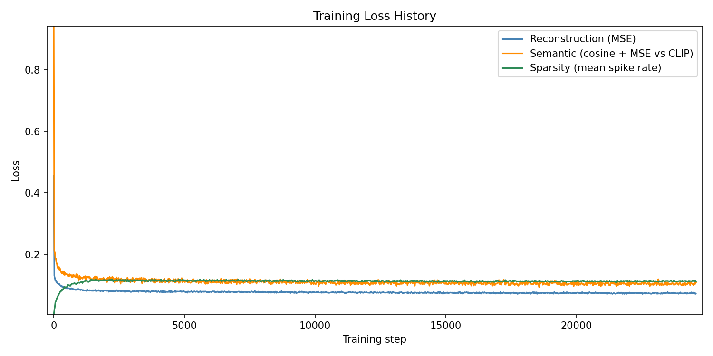

## Spike train autoencoder

This is a proof of concept of an autoencoder of images using leaky
integrate-and-fire neurons. The architecture of the autoencoder is best
illustrated by the following graphic:


The LIF encoder, decoder, and adapter are trained using the STL-10 dataset. The
embeddings emitted out of the adapter is trained against the embeddings
generated by OpenAI CLIP over the same input data.

### Usage

To train the model, run
```bash
$ python3 main.py
```

To run the model, run
```bash
python3 generate.py --image input.jpg --output output.png
```

| Input | Output |
|-------|-----------|
|  |  |
|  |  |
|  |  |

### Stats

To evaluate the model's accuracy based on the alignment of the generated
embedding of this model with CLIP's embedding from a text description of the
image class
```
$ python3 eval.py

Final results (8000 images):
  Direct CLIP accuracy:  99.41% (7953 / 8000)
  Spike model accuracy:  96.61% (7729 / 8000)
  Agreement rate:        96.55% (7724 / 8000)
```

Training loss history
